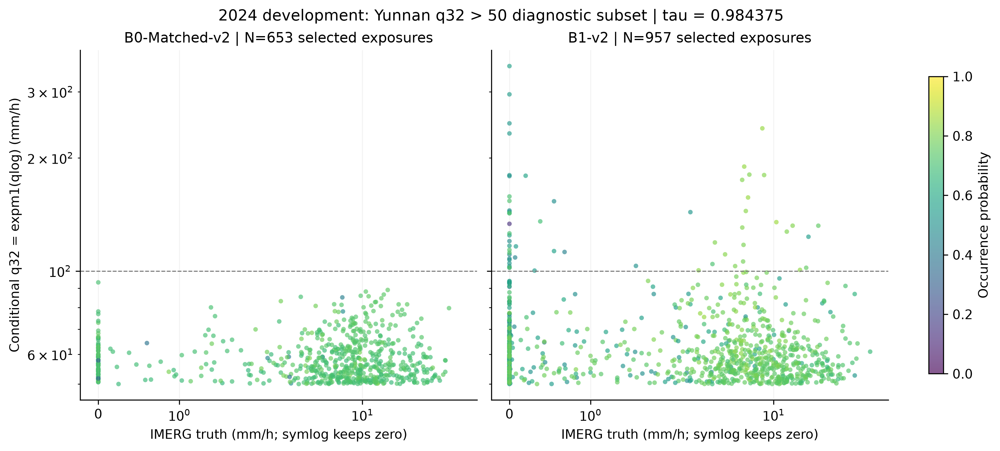

# 上尾物理合理性与暴露单位审查

q32 为条件 tau=0.984375 分位数，不是无条件均值，也不是点预测。对高分位数不能要求每次等于 IMERG。另一方面，过高尾部、真实干条件下缺少 quantile 直接监督和发生概率需要联合审查。没有 clamp、sort、物理上限或任何结果修改。

|模型|区域|最大 qlog|对应 mm/h（诊断转换）|q32 每 forward max p99|p99.9|FP64 overflow risk|
|---|---|---:|---:|---:|---:|---|
|B0_MATCHED_V2|YUNNAN_INSIDE|4.54600608548|93.255208|4.25004026117|4.48909491365|False|
|B0_MATCHED_V2|YUNNAN_OUTSIDE|6.66720781648|785.19733|5.04684530896|5.4761291241|False|
|B1_V2|YUNNAN_INSIDE|5.86386614966|351.08272|4.81713982394|5.47389451288|False|
|B1_V2|YUNNAN_OUTSIDE|8.48617442129|4846.2869|5.98370239391|6.85393999165|False|

B0_MATCHED_V2 YUNNAN_INSIDE 最大值位置：{"sample_id": "2024-06-13T18:00:00+00:00", "row": 57, "column": 70, "tau": 0.984375, "qlog": 4.546006085478263, "truth_mm_h": 0.0, "target_valid": true, "p_rain": 0.703125, "physical_overflow_risk": false}。

B0_MATCHED_V2 YUNNAN_OUTSIDE 最大值位置：{"sample_id": "2024-08-09T02:00:00+00:00", "row": 97, "column": 62, "tau": 0.984375, "qlog": 6.66720781647791, "truth_mm_h": 3.9099998474121094, "target_valid": true, "p_rain": 0.80859375, "physical_overflow_risk": false}。

B1_V2 YUNNAN_INSIDE 最大值位置：{"sample_id": "2024-03-27T21:30:00+00:00", "row": 19, "column": 42, "tau": 0.984375, "qlog": 5.8638661496646645, "truth_mm_h": 0.0, "target_valid": true, "p_rain": 0.56640625, "physical_overflow_risk": false}。

B1_V2 YUNNAN_OUTSIDE 最大值位置：{"sample_id": "2024-04-08T21:00:00+00:00", "row": 19, "column": 72, "tau": 0.984375, "qlog": 8.4861744212897, "truth_mm_h": 0.0, "target_valid": true, "p_rain": 0.486328125, "physical_overflow_risk": false}。

scene-pixel-tau exposure 将每个时次、像元和 tau 分别计数；scene-pixel any-tau exposure 每个时次像元只计一次，严格单调时等同 q32 超阈值；unique grid cells 跨场景去重同一目标格点；scenes 计有任何超阈值格点的场景。四者都不是独立降水事件。无预定义事件目录，不能从相邻场景自动制造独立事件数。超阈值采用 qlog>log1p(threshold)，阈值只作描述，不是 QC 或训练规则。

各区域全部阈值计数、唯一格点和场景数见 upper_tail_exposure_units.csv；每个 q32>50 的预声明诊断像元保存 sample_id、row/column、q32、p_rain、IMERG 真值及 valid/rainy 条件，见各模型 threshold_locations.jsonl。这是预测条件下的描述集合，不是新监督资格，也不是概率校准的全量条件集合。outside 数据不是主科学评价区域；目标 invalid 时不能当作无雨真值。

- B0_MATCHED_V2 云南 q32>100: 0 个 scene-pixel；相关真值/概率分布不可估计，不填零分布。
- B0_MATCHED_V2 云南 q32>500: 0 个 scene-pixel；相关真值/概率分布不可估计，不填零分布。
- B0_MATCHED_V2 云南 q32>1000: 0 个 scene-pixel；相关真值/概率分布不可估计，不填零分布。
- B1_V2 云南 q32>100: 58 个 scene-pixel；真实雨 30；真值 min/max=0/20.24 mm/h；p_rain min/max=0.1328125/0.84765625。
- B1_V2 云南 q32>500: 0 个 scene-pixel；相关真值/概率分布不可估计，不填零分布。
- B1_V2 云南 q32>1000: 0 个 scene-pixel；相关真值/概率分布不可估计，不填零分布。

FP64 physical boundary=log1p(float64_max)≈709.782712893384；这里报告 false 仅指此次冻结 BEST 2024 轨迹没有超过浮点边界，不是物理合理性通过，也不保证未来。100/500/1000 mm/h 的科学可信性仍需结合 IMERG 误差、实际概率、持续时间、地理位置和研究者领域判断。未与独立雨量站或雷达核验，IMERG 是监督参考，不是无误差绝对真值。

逐 epoch 历史直接复用 upper_tail_full_history_comparison_20261009_v1.json 和 upper_tail_history.csv，保持 Train/Validation 分开；不能将逐 epoch p99 平均或把区间 extrema 当作 pooled percentile。早期训练的高尾部与冻结 BEST 结果分开呈现。历史聚合无法恢复每 epoch 唯一格点/独立事件，该缺项明确保留。

## 已发表 17 epoch 历史

|模型|阶段|区域|跨完整 epoch 最大 qlog|所在 epoch|FP64 风险|
|---|---|---|---:|---:|---|
|B0_MATCHED_V2|TRAIN|YUNNAN_INSIDE|7.77195171|2|False|
|B0_MATCHED_V2|TRAIN|YUNNAN_OUTSIDE|11.059597|2|False|
|B0_MATCHED_V2|VALIDATION|YUNNAN_INSIDE|6.80366345|5|False|
|B0_MATCHED_V2|VALIDATION|YUNNAN_OUTSIDE|10.8280246|5|False|
|B1_V2|TRAIN|YUNNAN_INSIDE|8.89346905|2|False|
|B1_V2|TRAIN|YUNNAN_OUTSIDE|9.54411454|16|False|
|B1_V2|VALIDATION|YUNNAN_INSIDE|6.9407249|3|False|
|B1_V2|VALIDATION|YUNNAN_OUTSIDE|9.82183877|3|False|

历史训练/验证反复使用样本，这里是 exposure，不是新增独立观测。逐 epoch 描述性阈值计数和 p99/p99.9 原始序列见已发表 upper_tail_history.csv；上表最大值不是 pooled p99。

[逐暴露诊断表](figures/inside_q32_gt50_observations.csv)保留真实干值零；未据此定义独立事件。
